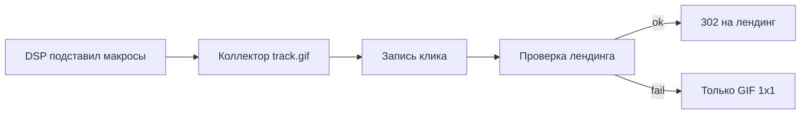

# Трекинг-коды: что генерируется сейчас и как должно генерироваться

Инструкция для генератора тегов (backend / v0 / visibla-front). Отложенное (OMID и т.п.) — [TRACKING_CODES_PHASE2_ROADMAP.md](TRACKING_CODES_PHASE2_ROADMAP.md).

Коллектор Verify зашит в `vb.js`. В HTML Smart Tag и в VPAID AdParameters **нет** `data-endpoint` / `"endpoint"`. Полный URL маяка остаётся в 1x1-пикселях и в VAST `<Impression>` / `<Tracking>` — это сами события, не конфиг SDK.

## Как читать

У каждого формата три блока:

| Блок | Что внутри |
| :--- | :--- |
| **Сейчас** | Что генератор реально отдаёт (или почему не отдаёт) |
| **Надо** | Эталон кода, который должен увидеть клиент после «Сгенерировать» |
| **Что сделать** | Правки генератора; номера задач — из плана внедрения |

Иерархия: **правила → блоки «Надо» → чек-лист и «Что сделать»**. Если чек-лист спорит с эталоном — правим чек-лист.

Все примеры ниже собраны на одних данных (`dsp_key = yandex`: клик `%reference%`, cachebuster `%aw_random%`). Все ID — десятичные числа:

| Сущность | Значение |
| :--- | :--- |
| Проект | `project_id = 1` |
| Кампания | `campaign_id = 105` |
| Источник (DSP) | `source_id = 24`, `dsp_key = yandex` |
| Креатив | `creative_id = 512` |
| Лендинг | `https://client.ru/promo` |

Базовый URL бикона Verify:

```
https://antifraud.servicepipe.ru/pixel/verify/track.gif?project=1&campaign=105&creative=512&source=24
```

Дальше дописываются только `event`, при необходимости `ts` / `error_code` / `redirect`.

---

## Правила, без которых выдача ломается

### 1. Два семейства коллекторов

Имена файлов `track.gif` совпадают, пути — нет. Не склеивать.

| Семейство | Кто использует | URL |
| :--- | :--- | :--- |
| Verify | Веб-пиксель (`pixel`), Image, HTML5 (в т.ч. запасной 1x1), VAST, VPAID | `https://antifraud.servicepipe.ru/pixel/verify/track.gif?project={project_id}&…` |
| Smart | Только Пиксель CTV (`pixel_ctv`) | `https://antifraud.servicepipe.ru/pixel/smart/{project_id}/track.gif?…` |

Не использовать `{project_id}.gif`, `verify2.gif`, `/pixel/smart/{project}/{campaign}.gif`.

### 2. Два уровня макросов

| Где | Кто подставляет | Какой макрос |
| :--- | :--- | :--- |
| Код для кабинета DSP (пиксели, Smart Tag, VAST Tag URL, запасной 1x1 баннера) | Площадка | `%aw_random%`, `%reference%`, `{{random}}`, … |
| XML, который наш сервер отдаёт плееру | Видеоплеер | `[CACHEBUSTER]`, `[ERRORCODE]` |

В VAST Tag URL: `ts=%aw_random%`. Внутри XML: `ts=[CACHEBUSTER]`. Это не рассинхрон.

### 3. Слои имён параметров

| Слой | Имена |
| :--- | :--- |
| Query бикона Verify и VAST XML | `project`, `campaign`, `source`, `creative` |
| HTML SDK (`data-*`) | `data-project-id`, `data-campaign-id`, `data-source-id`, `data-creative-id` |
| VPAID AdParameters JSON | `project`, `campaign`, `source`, `creative` |

Веб-пиксель и Verify: все четыре ID в query, в пути только литерал `track.gif`.

Пиксель CTV: в пути только `project`; в query — `campaign`, `source`, `creative`. `project` в query не дублируем.

Значения ID — только цифры, не `camp-001`, не `src-002`, не `new`.

### 4. Кодирование клика

- Макрос площадки никогда не экранируем.
- Лендинг сырой в HTML `href` и VAST `ClickThrough`.
- Лендинг percent-encode только как значение query (`redirect=`, `clickTag=` / `clickTAG=`).

Пример: `href="%reference%https://client.ru/promo"`, но `redirect=%reference%https%3A%2F%2Fclient.ru%2Fpromo`.

Лендинг обязателен там, где в выдаче есть `redirect` или кликовый `href` (веб-пиксель, Image, HTML5, VAST, VPAID). У Пикселя CTV лендинга нет.

#### 4.1 Рантайм: кто делает 302

§4 описывает, **как генератор собирает строку**. Этот пункт — что происходит, когда по ней стучатся.

Три роли, их не смешивать:

| Кто | Что делает |
| :--- | :--- |
| Генератор Visibla (v0 / ЛК / `buildBeaconUrl`) | Печатает URL с `event=click` и `redirect=`. Сам хит не принимает. |
| DSP | Подставляет макросы cachebuster (`ts`) и клика в `redirect`. |
| Коллектор `GET https://antifraud.servicepipe.ru/pixel/verify/track.gif` | Пишет событие. При валидном клике отвечает **HTTP 302**. FastAPI ЛК Visibla `track.gif` не обслуживает. |

**Когда 302.** Только если `event=click` **и** в query есть `redirect`. Показ (`impression`) и событийные трекеры VAST/VPAID — ответ 1×1 GIF **без** заголовка `Location`.

**Что лежит в `redirect` после DSP.** Макрос клика площадки (не экранирован) + percent-encoded лендинг, как в §4. Пример:

```
redirect=%reference%https%3A%2F%2Fclient.ru%2Fpromo
```

После подстановки DSP префикс `%reference%` становится URL клик-трекера площадки, хвост — `https://client.ru/promo`.

**Порядок на коллекторе**

1. Разобрать query (`project`, `campaign`, `creative`, `source`, `event`, `ts`, `redirect`).
2. Если в `ts` или `redirect` остались литералы макросов генератора или кабинета — запрос не из DSP (см. §4.2). Событие можно записать как брак. **302 не слать**, отдать 1×1 GIF.
3. Записать клик (в т.ч. если дальше защита не пустит — как отказ / IVT, без увода пользователя).
4. Проверить защиту §4.2.
5. Если ок: `302 Location` на целевой URL (клик-трекер DSP + лендинг, как получилось после подстановки). Тело ответа не важно, пустой GIF допустим.
6. Если `redirect` нет или §4.2 не прошёл: **302 не слать**, отдать 1×1 GIF как при показе. На чужой сайт не уводить.

Пиксель CTV: `event=click` и `redirect` не выдаём и на коллекторе Smart не обрабатываем как клик-редирект.



#### 4.2 Защита от open redirect

Абуз: подменить `redirect=` на чужой URL (`https://evil.com`) и получить доверенный редиректор с хоста `antifraud.servicepipe.ru`.

Накрутка ботами (IVT) сюда **не** входит. Если лендинг валиден, 302 можно отдать и боту; биллинг режет IVT отдельно, классификация не отменяет редирект.

На коллекторе обязательны **все** пункты сразу:

1. **Сверка с креативом.** Целевой лендинг не берётся слепо из query. По `project` + `campaign` + `creative` читается сохранённый `target_url` креатива. Из `redirect` снимается префикс клик-трекера DSP (макрос уже подставлен). Оставшийся URL должен совпасть с зарегистрированным лендингом: тот же origin (схема + хост + порт), путь не уезжает на другой домен. Чужой хост → 302 нет.
2. **Только `https:`.** Запрещены `javascript:`, `data:`, `file:`, protocol-relative `//evil.com`, `http:`.
3. **Неподставленные макросы.** Если в `ts` или `redirect` остались плейсхолдеры выдачи — `[CLICK_URL]`, `[CACHEBUSTER]`, `%reference%`, `%%CLICK_URL_UNESC%%`, `{{CLICK_URL}}`, `${CLICK_URL_ESC}` и аналоги — считать хит ручным/битым. 302 нет.
4. **Следующий шаг коллектора (не блокер генератора фазы 1).** HMAC в query (`sig=` от `project|campaign|creative|landing|exp`), который генератор считает при выдаче тега. Подмена `redirect` ломает подпись. Пока подписи нет, достаточно сверки с `target_url`. Генератор в фазе 1 по-прежнему печатает URL без `sig=`.

### 5. `bundle`

Только Пиксель CTV (`/pixel/smart/{project}/track.gif`). Плейсхолдер `bundle=<app_id>`: его вписывает площадка (app id Smart TV), не мы. У Verify `track.gif` параметра `bundle` нет.

### Про стандарты измерений (MRC / IAB)

Сами трекинг-коды стандартов MRC / IAB не несут. Согласованность выдачи с рантаймом ведёт SDK-контракт, а не редактор.

---

## Сводка

| # | Формат | `markup_format` | Билдер | Статус | Вкладки |
| :--- | :--- | :--- | :--- | :--- | :--- |
| 1 | Пиксель | `pixel` | `build_beacon_url` | нет в проде | URL показа / URL клика / HTML-тег |
| 2 | Image Display | `image_display` | `build_image_display_tag` | есть, без макросов DSP и без `vb.js` | Smart Tag / 1x1 Pixels / In-Banner |
| 3 | HTML5 Display | `html5_display` | `build_html5_display_tag` | есть, без макроса clickTag | Iframe / In-Banner / 1x1 Pixels |
| 4 | VAST | `vast` | `build_vast_xml` | сломан (нет Tag URL, нет `ts`) | VAST Tag URL / VAST XML / Трекеры |
| 5 | VPAID | `vpaid` | `build_vpaid_xml` | сломан (события без ID) | VAST Tag URL / VPAID XML / Трекеры |
| 6 | Пиксель CTV | `pixel_ctv` | `build_ctv_pixel_url` | нет | URL показа |

Формат `pixel` — счётчики без ассета. URL показа совпадает с вкладкой «1x1 Pixels» Image/HTML5.

---

# Формат 1. Пиксель

Клиент вставляет ссылки в поля «Счётчик показов» и «Счётчик переходов» кабинета DSP, без баннера. Показ и клик — **один** креатив. Показ = тот же Verify, что вкладка 1x1 баннера.

### Сейчас

В проде формата нет. В v0: три вкладки на Verify (`buildBeaconUrl` / `verifyPixelPairItems`), лендинг обязателен. URL показа совпадает с вкладкой «1×1 Pixels» Image/HTML5. Функции `buildPixelUrl` нет.

### Надо

**Вкладка 1 — URL показа**

```
https://antifraud.servicepipe.ru/pixel/verify/track.gif?project=1&campaign=105&creative=512&source=24&event=impression&ts=%aw_random%
```

**Вкладка 2 — URL клика**

```
https://antifraud.servicepipe.ru/pixel/verify/track.gif?project=1&campaign=105&creative=512&source=24&event=click&ts=%aw_random%&redirect=%reference%https%3A%2F%2Fclient.ru%2Fpromo
```

Тот же Verify GIF, `event=click`. Лендинг обязателен.

**Вкладка 3 — HTML-тег 1x1**

```html

```

### Что сделать

1. Генератор: `build_beacon_url` (тот же, что запасной 1x1 баннера). `MarkupFormat` += `pixel`, `target_url` обязателен.
2. Задача 12: формат `pixel` в visibla-front.

---

# Формат 2. Image Display (Smart Tag)

Графический баннер. SDK: `https://storage.yandexcloud.net/visibla/vb.js`. Коллектор внутри скрипта.

### Сейчас

`build_image_display_tag` работает, но `target_url` подставляется голым, `dsp_key` до билдера не доходит. В теге `visibla-tag.min.js`.

### Надо

**Вкладка 1 — JS Smart Tag**

```html
<div class="visibla-container" style="position:relative;width:100%;height:auto;display:inline-block;">
  <a href="%reference%https://client.ru/promo" target="_blank" rel="noopener" id="visibla-click-area" style="display:block;text-decoration:none;">
    
  </a>
  <script
    data-project-id="1"
    data-campaign-id="105"
    data-source-id="24"
    data-creative-id="512"
    async
    src="https://storage.yandexcloud.net/visibla/vb.js">
  </script>
</div>
```

Клик: макрос площадки в `href`; SDK шлёт GET GIF на `pointerdown`. SDK принимает и `data-project`, и `data-project-id`.

**Вкладка 2 — 1x1 Pixels** (если площадка не принимает JS) — те же два URL Verify, что у формата 1.

**Вкладка 3 — In-Banner** — только `<script>` без обёртки:

```html
<script
  data-project-id="1"
  data-campaign-id="105"
  data-source-id="24"
  data-creative-id="512"
  async
  src="https://storage.yandexcloud.net/visibla/vb.js">
</script>
```

### Что сделать

1. Задачи 3–4: `build_beacon_url` + макрос клика в `build_image_display_tag`.
2. `src` = `vb.js`, атрибуты `data-*-id`, без `data-endpoint`.
3. Задачи 8 / 10 / 12: вкладки выдачи вместо одного `<pre>`.

---

# Формат 3. HTML5 Display

Интерактивный баннер из ZIP.

### Сейчас

`build_html5_display_tag` собирает `?clickTag={target_url}` без макроса площадки и без второго регистра `clickTAG`. Ширина/высота креатива в БД не хранятся.

### Надо

**Вкладка 1 — Iframe-обёртка**

```html
<div class="visibla-container" style="position:relative;width:300px;height:250px;">
  <iframe
    src="https://storage.yandexcloud.net/visibla/html5/512/index.html?clickTag=%reference%https%3A%2F%2Fclient.ru%2Fpromo&clickTAG=%reference%https%3A%2F%2Fclient.ru%2Fpromo"
    width="300"
    height="250"
    frameborder="0"
    scrolling="no"
    style="border:none;width:100%;height:100%;">
  </iframe>
  <script
    data-project-id="1"
    data-campaign-id="105"
    data-source-id="24"
    data-creative-id="512"
    async
    src="https://storage.yandexcloud.net/visibla/vb.js">
  </script>
</div>
```

**Вкладка 2 — In-Banner** — тот же `<script>`, что во вкладке 3 формата 2; вставляется в `<head>` `index.html` до упаковки ZIP.

**Вкладка 3 — 1x1 Pixels** — те же два URL Verify, что у формата 1.

### Что сделать

1. Задача 2: поля `width` / `height` в `creative`.
2. Задача 4: макрос площадки в `clickTag` и дубль `clickTAG`.
3. Тот же Smart Tag, что в формате 2 (`vb.js`, без `data-endpoint`).

---

# Формат 4. VAST 3.0

Pre-roll / mid-roll / post-roll / outstream. Площадки РФ берут **URL**, не XML-текст: вкладка 1 — главная выдача.

Параметра `account` в эталоне нет — не добавлять.

### Сейчас

`GET /api/vast/{id}.xml` нет: тег собирается один раз при create и не регенерируется. В `vast_template.xml` нет `ts=[CACHEBUSTER]`; `<Impression>` пишет `account=track`, квартили — `account={ACCOUNT_ID}`. Сторонние трекеры через `{EXTRA_*}` уже работают.

### Надо

**Вкладка 1 — VAST Tag URL**

```
https://antifraud.servicepipe.ru/api/vast/512.xml?source=24&ts=%aw_random%
```

**Вкладка 2 — VAST XML** (макросы плеера).

`ts=[CACHEBUSTER]` у impression, start, квартилей, complete, click. У mute / unmute / pause / resume — без `ts`. У error — `error_code=[ERRORCODE]`, без `ts`.

```xml
<?xml version="1.0" encoding="UTF-8"?>
<VAST version="3.0">
  <Ad id="105">
    <InLine>
      <AdSystem>Visibla</AdSystem>
      <AdTitle><![CDATA[Ролик 15 сек]]></AdTitle>
      <Error><![CDATA[https://antifraud.servicepipe.ru/pixel/verify/track.gif?project=1&campaign=105&creative=512&source=24&event=error&error_code=[ERRORCODE]]]></Error>
      <Impression id="visibla_imp"><![CDATA[https://antifraud.servicepipe.ru/pixel/verify/track.gif?project=1&campaign=105&creative=512&source=24&event=impression&ts=[CACHEBUSTER]]]></Impression>
      <Creatives>
        <Creative id="512">
          <Linear>
            <Duration>00:00:15</Duration>
            <TrackingEvents>
              <Tracking event="start"><![CDATA[https://antifraud.servicepipe.ru/pixel/verify/track.gif?project=1&campaign=105&creative=512&source=24&event=start&ts=[CACHEBUSTER]]]></Tracking>
              <Tracking event="firstQuartile"><![CDATA[https://antifraud.servicepipe.ru/pixel/verify/track.gif?project=1&campaign=105&creative=512&source=24&event=firstQuartile&ts=[CACHEBUSTER]]]></Tracking>
              <Tracking event="midpoint"><![CDATA[https://antifraud.servicepipe.ru/pixel/verify/track.gif?project=1&campaign=105&creative=512&source=24&event=midpoint&ts=[CACHEBUSTER]]]></Tracking>
              <Tracking event="thirdQuartile"><![CDATA[https://antifraud.servicepipe.ru/pixel/verify/track.gif?project=1&campaign=105&creative=512&source=24&event=thirdQuartile&ts=[CACHEBUSTER]]]></Tracking>
              <Tracking event="complete"><![CDATA[https://antifraud.servicepipe.ru/pixel/verify/track.gif?project=1&campaign=105&creative=512&source=24&event=complete&ts=[CACHEBUSTER]]]></Tracking>
              <Tracking event="mute"><![CDATA[https://antifraud.servicepipe.ru/pixel/verify/track.gif?project=1&campaign=105&creative=512&source=24&event=mute]]></Tracking>
              <Tracking event="unmute"><![CDATA[https://antifraud.servicepipe.ru/pixel/verify/track.gif?project=1&campaign=105&creative=512&source=24&event=unmute]]></Tracking>
              <Tracking event="pause"><![CDATA[https://antifraud.servicepipe.ru/pixel/verify/track.gif?project=1&campaign=105&creative=512&source=24&event=pause]]></Tracking>
              <Tracking event="resume"><![CDATA[https://antifraud.servicepipe.ru/pixel/verify/track.gif?project=1&campaign=105&creative=512&source=24&event=resume]]></Tracking>
            </TrackingEvents>
            <VideoClicks>
              <ClickThrough id="visibla_click"><![CDATA[https://client.ru/promo]]></ClickThrough>
              <ClickTracking id="visibla_click_track"><![CDATA[https://antifraud.servicepipe.ru/pixel/verify/track.gif?project=1&campaign=105&creative=512&source=24&event=click&ts=[CACHEBUSTER]]]></ClickTracking>
            </VideoClicks>
            <MediaFiles>
              <MediaFile delivery="progressive" type="video/mp4" width="1920" height="1080" bitrate="2500" scalable="true" maintainAspectRatio="true">
                <![CDATA[https://storage.yandexcloud.net/visibla/creatives/512.mp4]]>
              </MediaFile>
            </MediaFiles>
          </Linear>
        </Creative>
      </Creatives>
    </InLine>
  </Ad>
</VAST>
```

**Вкладка 3 — событийные трекеры**

```
impression      https://antifraud.servicepipe.ru/pixel/verify/track.gif?project=1&campaign=105&creative=512&source=24&event=impression&ts=[CACHEBUSTER]
start           https://antifraud.servicepipe.ru/pixel/verify/track.gif?project=1&campaign=105&creative=512&source=24&event=start&ts=[CACHEBUSTER]
firstQuartile   https://antifraud.servicepipe.ru/pixel/verify/track.gif?project=1&campaign=105&creative=512&source=24&event=firstQuartile&ts=[CACHEBUSTER]
midpoint        https://antifraud.servicepipe.ru/pixel/verify/track.gif?project=1&campaign=105&creative=512&source=24&event=midpoint&ts=[CACHEBUSTER]
thirdQuartile   https://antifraud.servicepipe.ru/pixel/verify/track.gif?project=1&campaign=105&creative=512&source=24&event=thirdQuartile&ts=[CACHEBUSTER]
complete        https://antifraud.servicepipe.ru/pixel/verify/track.gif?project=1&campaign=105&creative=512&source=24&event=complete&ts=[CACHEBUSTER]
click           https://antifraud.servicepipe.ru/pixel/verify/track.gif?project=1&campaign=105&creative=512&source=24&event=click&ts=[CACHEBUSTER]
error           https://antifraud.servicepipe.ru/pixel/verify/track.gif?project=1&campaign=105&creative=512&source=24&event=error&error_code=[ERRORCODE]
```

### Что сделать

1. Задача 2: персистентность полей, без которой XML нельзя пересобрать.
2. Задачи 3 и 5: `build_beacon_url` → `track.gif?project=…`; `ts=[CACHEBUSTER]` у impression / start / квартилей / complete / click; mute / pause / resume / error — как в эталоне; параметр `account` не добавлять.
3. Задача 7: публичный `GET /api/vast/{creative_id}.xml` (`Content-Type: application/xml`, `Access-Control-Allow-Origin: *`).

---

# Формат 5. VPAID 2.0

Телеметрия плеера и видимость видео в iframe. Тот же VAST Tag URL, что у формата 4: тип манифеста берётся из сохранённого `markup_format`.

### Сейчас

Шаблон неатрибутируем:

```xml
<Error><![CDATA[https://antifraud.servicepipe.ru/pixel/verify/track.gif?error={CAMPAIGN_ID}]]></Error>
<Impression id="imp1"><![CDATA[https://antifraud.servicepipe.ru/pixel/verify/track.gif?event=impression]]></Impression>
```

Нет `project` / `source` / `creative`, нет MP4-fallback, `<VideoClicks>`, квартилей, `clickUrl` в AdParameters.

### Надо

**Вкладка 1 — VAST Tag URL** — как в формате 4.

**Вкладка 2 — VPAID XML**

```xml
<?xml version="1.0" encoding="UTF-8"?>
<VAST version="3.0">
  <Ad id="105">
    <InLine>
      <AdSystem>Visibla</AdSystem>
      <AdTitle><![CDATA[Ролик 15 сек]]></AdTitle>
      <Error><![CDATA[https://antifraud.servicepipe.ru/pixel/verify/track.gif?project=1&campaign=105&creative=512&source=24&event=error&error_code=[ERRORCODE]]]></Error>
      <Impression id="visibla_vpaid_imp"><![CDATA[https://antifraud.servicepipe.ru/pixel/verify/track.gif?project=1&campaign=105&creative=512&source=24&event=impression&ts=[CACHEBUSTER]]]></Impression>
      <Creatives>
        <Creative id="512">
          <Linear>
            <Duration>00:00:15</Duration>
            <AdParameters><![CDATA[{
  "project": "1",
  "campaign": "105",
  "source": "24",
  "creative": "512",
  "videoUrl": "https://storage.yandexcloud.net/visibla/creatives/512.mp4",
  "clickUrl": "https://client.ru/promo"
}]]></AdParameters>
            <MediaFiles>
              <MediaFile apiFramework="VPAID" type="application/javascript" delivery="progressive" width="1920" height="1080">
                <![CDATA[https://storage.yandexcloud.net/visibla/vb.js]]>
              </MediaFile>
              <MediaFile delivery="progressive" type="video/mp4" width="1920" height="1080" bitrate="2500" scalable="true" maintainAspectRatio="true">
                <![CDATA[https://storage.yandexcloud.net/visibla/creatives/512.mp4]]>
              </MediaFile>
            </MediaFiles>
          </Linear>
        </Creative>
      </Creatives>
    </InLine>
  </Ad>
</VAST>
```

Сначала JS (`vb.js`), затем MP4. Без VPAID у плеера считается только server `<Impression>`. В AdParameters опционально `skippable` / `linear`. **`coreUrl` и `endpoint` не слать.**

**Вкладка 3 — событийные трекеры** — как в формате 4.

### Что сделать

1. Задача 5: переписать `vpaid_template.xml` целиком (ID, квартили, `VideoClicks`, MP4, `clickUrl`, MediaFile = `vb.js`, без `coreUrl`, без `endpoint`, без `account`).
2. Задачи 3 и 7 — те же, что у формата 4.

---

# Формат 6. Пиксель CTV

Счётчик для Smart TV / CTV без клика и без лендинга. Другое семейство коллектора: `/pixel/smart/{project_id}/track.gif`.

### Сейчас

В проде нет. В v0 формат `pixel_ctv`: одна вкладка (URL показа), `/pixel/smart/{project_id}/track.gif`, без клика, HTML и лендинга.

### Надо

**Вкладка 1 — URL показа**

```
https://antifraud.servicepipe.ru/pixel/smart/1/track.gif?campaign=105&source=24&creative=512&event=impression&bundle=<app_id>&ts=%aw_random%
```

Вкладки клика и HTML-тега 1×1 нет. `event=click` и `redirect` не выдаём.

### Что сделать

1. `MarkupFormat` += `pixel_ctv`, билдер `build_ctv_pixel_url`.
2. Мастер и редактор: без лендинга, одна вкладка URL показа.
3. visibla-front — вместе с форматом `pixel`.

---

# Медиаплан (все форматы)

### Сейчас

В v0 диалог XLSX/CSV есть. В проде кнопка «Скачать пиксели» ещё отдаёт `.txt`; фолбэк ссылается на несуществующий `track.visibla.ru`.

### Надо

XLSX/CSV по кампании:

`ID кампании | Название кампании | Источник (DSP) | ID креатива | Название креатива | Формат | Ссылка показа | Ссылка клика | VAST Tag URL | Smart Tag Code`

| Формат | Показ | Клик |
| :--- | :--- | :--- |
| `pixel`, Image, HTML5 | Verify `track.gif?project=…` | Verify `event=click` + `redirect` |
| `pixel_ctv` | `/pixel/smart/{project}/track.gif?…` | пусто |
| VAST / VPAID | событийный URL бикона | событийный URL клика + колонка VAST Tag URL |

### Что сделать

Задачи 9, 10, 12: серверный экспорт, экран в v0, снять заглушки в visibla-front.

---

## Чек-лист приёмки генератора

- [ ] Verify (`/pixel/verify/track.gif?project=…`) — веб-пиксель, Image/HTML5 1x1, VAST/VPAID события. Не `{project_id}.gif`, не `verify2.gif`
- [ ] `/pixel/smart/` только у `pixel_ctv`, путь `/{project_id}/track.gif`, не `/{project}/{campaign}.gif`
- [ ] Smart Tag и VPAID AdParameters **не** содержат endpoint; коллектор внутри `vb.js`
- [ ] `ts` у impression, start, квартилей, complete, click (в XML — `[CACHEBUSTER]`, в коде для DSP — макрос площадки). У mute / unmute / pause / resume / error — как в эталоне XML
- [ ] В коде для DSP стоит макрос площадки, в XML для плеера — `[CACHEBUSTER]`
- [ ] Кликовая ссылка веб-пикселя и баннера содержит макрос клика выбранной платформы
- [ ] `bundle=<app_id>` только у CTV. У Verify `track.gif` параметра `bundle` нет
- [ ] Четыре идентификатора: у Verify все в query; у CTV `project` в пути, остальные в query. Нет `company`. ID только цифры
- [ ] Query и JSON без суффикса `_id`; HTML SDK — `data-*-id`
- [ ] У веб-пикселя показ и клик с одним `creative`. У CTV нет `event=click` и `redirect`; одна вкладка URL показа
- [ ] Редактор: «Скачать ZIP» отдаёт все вкладки генератора одним архивом
- [ ] Smart Tag и VPAID `MediaFile` — `https://storage.yandexcloud.net/visibla/vb.js`; `coreUrl` нет
- [ ] В кликовой ссылке Smart Tag (`<a href=…>`) стоит `rel="noopener"`
- [ ] В VAST и VPAID есть рабочий `MediaFile` типа `video/mp4`; параметра `account` нет
- [ ] `/api/vast/*` отдаёт `Content-Type: application/xml; charset=utf-8` и `Access-Control-Allow-Origin: *`
- [ ] Все ссылки на SDK и медиафайлы — по HTTPS, без mixed content
- [ ] Сторонние пиксели клиента валидируются на схему `https://`
- [ ] Генератор и зашитый в `vb.js` хост совпадают на Verify `track.gif?project=…` для маяков (не атрибут тега)
- [ ] Коллектор при `event=click` и валидном `redirect` отвечает 302; `impression` и прочие события — без `Location`
- [ ] 302 только если лендинг после снятия клик-трекера DSP совпал с `target_url` креатива и схема `https:`
- [ ] Литералы макросов в `ts` / `redirect` хита → без 302, ответ 1×1 GIF
- [ ] Visibla API ЛК не обслуживает `track.gif`; 302 делает коллектор `antifraud.servicepipe.ru`

---

## Вне этого эталона (контракт смежникам)

- Хост VAST Tag URL в примерах — `antifraud.servicepipe.ru`. Если прокси не будет, в выдаче появится хост нашего API; до решения используем URL из «Надо».
- HTTP 302 по кликовому `track.gif` — контракт коллектора Servicepipe (`/pixel/verify/track.gif`), не FastAPI ЛК Visibla. Генератор только печатает query `redirect=`.
